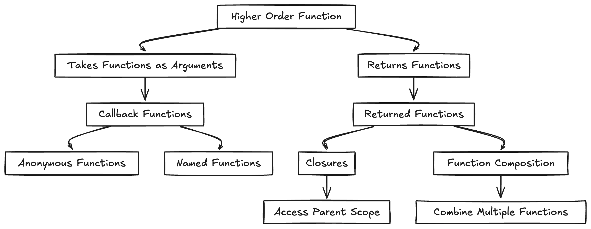

# Intermediate Level

This category is for those ready to dive deeper. You'll find questions with code snippets that require hands-on practice and a bit of experimentation. Perfect for honing your skills and understanding how to apply concepts in real-world scenarios.

## Table of Contents

1. [What are Browser APIs?](#what-are-browser-apis)
2. [What are WeakSet and WeakMap?](#what-are-weakset-and-weakmap)
3. [What is Debouncing?](#what-is-a-debouncing)
4. [What is Throttling?](#what-is-throttling)
5. [What are higher order functions?](#what-are-higher-order-functions)
6. [Deep Copy vs Shallow Copy](#deep-copy-vs-shallow-copy)


## What are Browser APIs?
Browser APIs are built-in capabilities provided by the browser to interact with various functionalities like manipulating the DOM, handling events, and making network requests. These APIs enable developers to create dynamic and interactive web applications.


## What are WeakSet and WeakMap?
WeakSet and WeakMap are special collections in JavaScript that hold weak references to objects. This means that the references do not prevent the objects from being garbage collected, making these collections memory-efficient.

:::details Example
```javascript
let obj = {};
let weakMap = new WeakMap();

weakMap.set(obj, 'some value');
console.log(weakMap.get(obj)); // Output: 'some value'

obj = null; // Now the object is eligible for garbage collection

```
:::

## What is Debouncing?

Debouncing is a technique used in JavaScript to limit the rate at which a function is called, especially in response to frequent events such as user input.

The idea behind debouncing is to ensure that a function is executed only after a certain amount of time has passed since the last time it was called. This is useful in situations where you want to avoid triggering a function too often, such as when handling events like scrolling or resizing, or when implementing typeahead search functionality. 


:::details Example: Debouncing a Function
```javascript
function debounce(func, delay) {
  let timeoutId;
  return function(...args) {
    clearTimeout(timeoutId);
    timeoutId = setTimeout(() => func.apply(this, args), delay);
  };
}

window.addEventListener('resize', debounce(() => {
  console.log('Window resized');
}, 300));

```
:::

## What is Throttling?

Throttling is a technique that limits the execution of a function to once in a specified time interval, regardless of how often the event occurs. Unlike debouncing, throttling guarantees the function will be executed at regular intervals.

:::details Example: Throttling a Function
```javascript
function throttle(func, limit) {
  let lastFunc;
  let lastRan;
  return function(...args) {
    const context = this;
    if (!lastRan) {
      func.apply(context, args);
      lastRan = Date.now();
    } else {
      clearTimeout(lastFunc);
      lastFunc = setTimeout(function() {
        if (Date.now() - lastRan >= limit) {
          func.apply(context, args);
          lastRan = Date.now();
        }
      }, limit - (Date.now() - lastRan));
    }
  };
}

window.addEventListener('scroll', throttle(() => {
  console.log('Scrolling...');
}, 200));

```
:::


## What are higher order functions?
In JavaScript, a higher-order function is a function that either:

- Takes one or more functions as arguments.
- Returns a function as its result.

Higher-order functions enable powerful functional programming techniques and can make code more modular and reusable.



### Key Uses

- **Function composition**: Combine smaller functions into more complex functions.
- **Abstraction**: Simplify complex behavior by abstracting it away, making the code easier to manage and understand.
- **Asynchronous programming**:  Handle asynchronous operations like callbacks and promises.


## What is Currying?

Currying is a functional programming technique in JavaScript where a function is transformed into a sequence of functions, each taking a single argument.

**Currying** is a transformation of functions that translates a function from `f(a, b, c)` => `f(a)(b)(c)`

> [!IMPORTANT]
> The currying requires the function to have a fixed number of arguments.
### Benefits of Currying

- **Improves Function Reusability**: Allows partial application of functions, making them more flexible.
- **Enhances Readability**: Can make code more readable by breaking down complex functions into simpler ones.
- **Facilitates Function Composition**: Makes it easier to create higher-order functions and compose them.

### Example

Consider a function that multiplies three numbers:

:::details Example of Currying
```javascript
function curryMultiply(a) {
  return function (b) {
    return function (c) {
      return a * b * c;
    };
  };
}


const result = curryMultiply(2)(3)(4);
console.log(result); // Output: 24
```
:::


## Deep Copy vs. Shallow Copy

The concept dictate how data is duplicated and managed in memory.

### Shallow Copy

A shallow copy of an object creates a new object, but it does not create copies of nested objects. Instead, it copies references to the nested objects. This means that changes to the nested objects will be reflected in both the original and the copied object.

```javascript
const original = {
  name: 'Alice',
  address: {
    city: 'Wonderland',
    zip: '12345'
  }
};

// Shallow copy using Object.assign()
const shallowCopy = Object.assign({}, original);

// Modifying the nested object in the shallow copy
shallowCopy.address.city = 'New Wonderland';

console.log(original.address.city); // Output: 'New Wonderland'
console.log(shallowCopy.address.city); // Output: 'New Wonderland'
```
### Deep Copy
A deep copy creates a new object and recursively copies all nested objects. Changes to the nested objects in the copied object do not affect the original object.

```javascript
const original = {
  name: "Alice",
  details: {
    age: 30,
    city: "New York"
  }
};

// Creating a deep copy
const deepCopy = JSON.parse(JSON.stringify(original));

// Modify the nested object in the copy
deepCopy.details.city = "Los Angeles";

console.log(original.details.city); // Outputs: "New York"
console.log(deepCopy.details.city); // Outputs: "Los Angeles"
```


## What is polyfill?

A polyfill in JavaScript is a piece of code used to provide functionality for features not supported in older browsers. It helps ensure compatibility by emulating modern JavaScript features.

::: tip NOTE
If an interviewer asks this question, a follow-up question might be to write a polyfill function.
:::

::: code-group 
```javascript [Polyfill for Array.Map ]
Array.prototype.customMap = function(callback) {
  const result = [];
  
  for (let i = 0; i < this.length; i++) {
    if (this.hasOwnProperty(i)) {
      result.push(callback(this[i], i, this));
    }
  }
  
  return result;
};

const arr = [1, 2, 3];
const square = x => x ** 2;
const modifiedArr = arr.customMap(square);

console.log(modifiedArr); // [1, 4, 9]
```
```javascript [Polyfill for Array.Filter]
Array.prototype.customFilter = function(callback) {
  const result = [];
  
  for (let i = 0; i < this.length; i++) {
    if (this.hasOwnProperty(i) && callback(this[i], i, this)) {
      result.push(this[i]);
    }
  }
  
  return result;
};

const arr = [1, 2, 3, 4, 5];
const evens = arr.customFilter(el => el % 2 === 0);

console.log(evens); // [2, 4]
```
:::