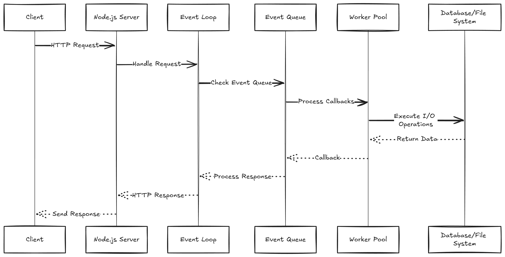

# Node.js Questions

Here are some of the most common and high-impact questions you might encounter in your interviews. These key questions frequently start conversations and are favorites among interviewers. Prepare well, and you'll be ready to impress!

## Table of Contents

1. [What is Node.js?](#what-is-node.js)

## What is Node.js?

Node.js is a JavaScript runtime built on Chrome's V8 engine, allowing developers to run JavaScript code outside of a browser. It's designed for building scalable and efficient network applications.

### Node.js Architecture Overview

1. **Request Flow**:
   - Clients send requests to the Node.js server.
   - Requests are stored in the **Event Queue** using a First-Come, First-Served (FCFS) method.

2. **Event Loop**:
   - Processes requests from the Event Queue.
   - Differentiates between blocking and non-blocking requests.

### Request Types

#### Non-Blocking Requests:
- Executed asynchronously; the program continues without waiting.
- The Event Loop handles these requests quickly, allowing other operations to proceed.

#### Blocking Requests:
- Executed synchronously; the program pauses until completion.
- A thread processes the request, and responses are sent back to clients.
- Default thread pool size is 4 (can increase based on CPU cores).

### Challenges with Blocking Requests:
- Increased client load can exhaust limited threads, causing delays.
- Prefer non-blocking requests to avoid user wait times and improve experience.

### Recommendation:
- Aim to make most requests non-blocking to enhance application scalability and user experience.
